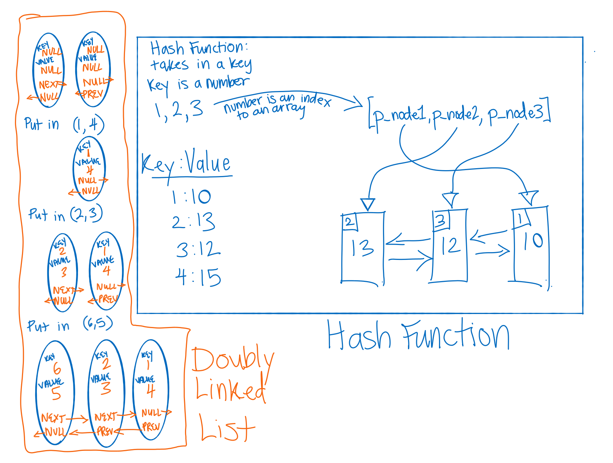

QUESTIONS

What makes it concurrent?
Are the double linked structure and the hashmap the same thing or are they built to operate together?
Do the hashmap keys or values live in the nodes of the doubly linked list? Where do the other components live?

TESTS

RESOURCES

hashtable versus hashmap: https://stackoverflow.com/questions/32274953/difference-between-hashmap-and-hashtable-purely-in-data-structures

What is a hashmap? https://en.wikibooks.org/wiki/A-level_Computing/AQA/Paper_1/Fundamentals_of_data_structures/Dictionaries#:~:text=A%20dictionary%20is%20also%20called,caches%20and%20high%2Dperformance%20databases

youtube video on hashtables: https://www.youtube.com/watch?v=shs0KM3wKv8&ab_channel=HackerRank
